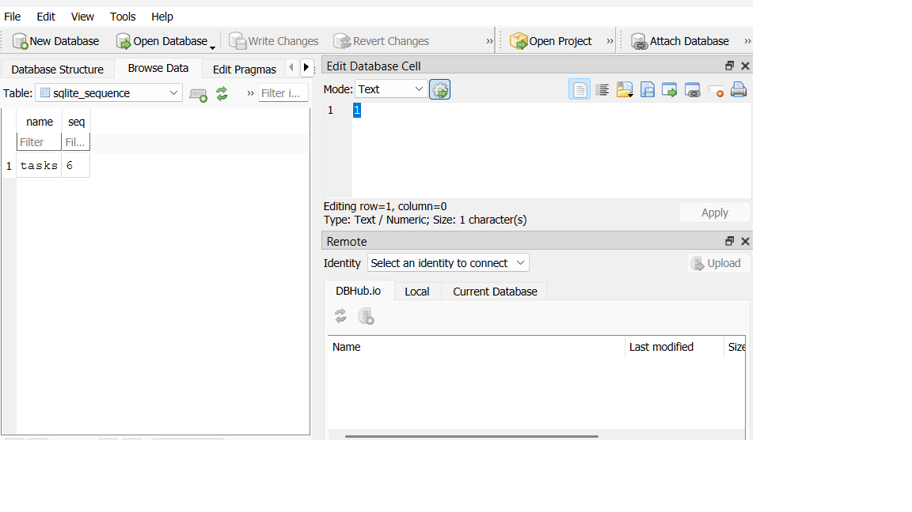

# Task API

A simple CRUD API for managing a to-do list, built with Python and FastAPI.
Data is stored in a **SQLite database** (`tasks.db`) — it survives server restarts.

## How to run it

1. Clone this repo and open a terminal in the folder.
2. Create and activate a virtual environment:

python -m venv venv
venv\Scripts\activate

3. Install dependencies:

pip install fastapi uvicorn

4. Start the server:

uvicorn main:app --reload

5. Visit `http://127.0.0.1:8000` in your browser, or `http://127.0.0.1:8000/docs` for interactive Swagger UI.

The first time the server runs, it automatically creates `tasks.db` and a `tasks` table, and inserts 3 example tasks if the table is empty. No manual setup is needed.

## Why SQLite

SQLite was chosen because it requires no separate database server or installation — it's a single file (`tasks.db`) that Python's built-in `sqlite3` module can read and write directly. That makes it ideal for a small project like this: simple to set up, easy to inspect, and still real SQL underneath.

## Where the database file is stored

The database lives at the root of the project folder, in a file called `tasks.db`. It's created automatically on first run and is excluded from version control via `.gitignore`.

## Endpoints

| Method | Path            | Description                    |
|--------|-----------------|--------------------------------|
| GET    | /               | API info                       |
| GET    | /health         | Health check                   |
| GET    | /tasks          | List all tasks                 |
| GET    | /tasks/{id}     | Get a single task by id        |
| POST   | /tasks          | Create a new task               |
| PUT    | /tasks/{id}     | Update a task's title/done      |
| DELETE | /tasks/{id}     | Delete a task                   |

## Example request

curl -i http://127.0.0.1:8000/tasks/1

Response:

HTTP/1.1 200 OK
content-type: application/json

{"id":1,"title":"Buy groceries","done":false}

## Example SQL query

Run directly against `tasks.db` using a SQLite viewer (e.g. DB Browser for SQLite):

SELECT * FROM tasks WHERE done = 1;

This returns every task marked as completed.

## Swagger UI

Screenshot below shows all endpoints available at `/docs`:

(screenshot added separately after pushing)

## Database viewer screenshot

## Notes

The API's endpoints, request bodies, and responses are identical to the earlier in-memory version — only the storage layer changed, from a Python list to a SQLite database.